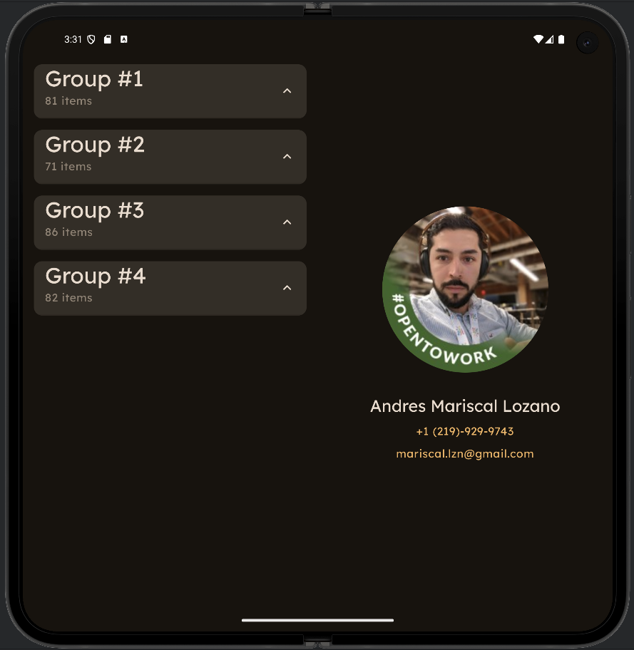
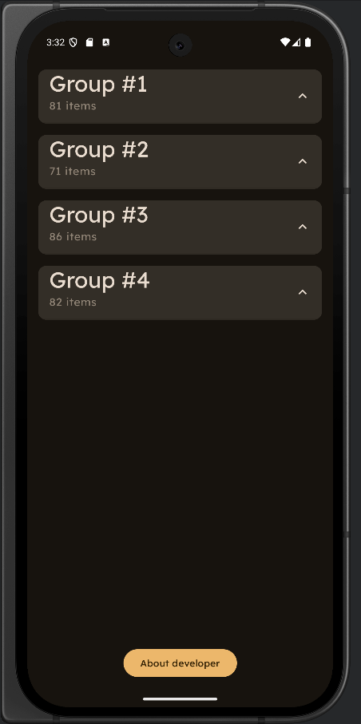
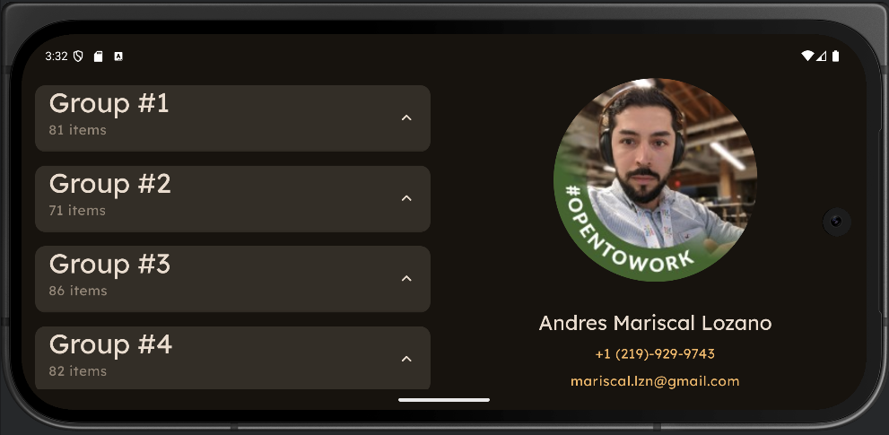
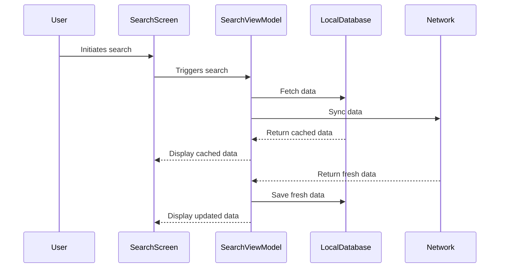

# Fetch Interview
This project, while small in its core requirement of fetching and displaying data from a URL, incorporates a robust and scalable architecture. While the initial impression might be daunting, this walkthrough will clarify the project structure, explaining the rationale behind each component and the strategic decisions made for this take-home interview. This approach demonstrates not only the ability to meet the basic requirements but also to build a solid foundation for future expansion and maintainability.

## Technology Stack

This project leverages the following technologies:

* **Jetpack Compose**
* **Hilt**
* **Jetpack Compose Navigation**
* **Retrofit**
* **Room**
* **Coroutines**
* **Kotlin Flows**
* **Material Design 3**
* **Coil**
* **Unit tests**
* **Benchmark**
* **KDocs**

## Architecture

This project employs the Model-View-Intent (**MVI**) architectural pattern, enhanced by a lightweight, custom-built **Redux-inspired** module that I have created a while back for my toy projects.  This combination allows for an **unidirectional flow of data**, making the application state predictable and easier to manage.

At the same time, it's built using a multi-module architecture that enable further improvements, maintenance and isolation.

These are the modules added:

* **feature:** In here all "Screens" will be placed but not limited to just screens. It could have auto, watch, tv as well as widgets, custom notifications etc...
* **core:** This module contains core functionalities such as:
  * **uisystem:** Use to define the custom theme of the application [Theme](core/uisystem/src/main/kotlin/com/fetch/core/uisystem/theme/Theme.kt) including [Colors](core/uisystem/src/main/kotlin/com/fetch/core/uisystem/theme/Color.kt) and [Typography](core/uisystem/src/main/kotlin/com/fetch/core/uisystem/theme/Type.kt).
  * **model:** Data classes.
  * **redux:** A lightweight version of the popular [Redux-Toolkit](https://redux-toolkit.js.org/tutorials/quick-start) that I built .
* **data:**
  * **api:** This module defines the interfaces to connect with the data sources such as local or network.
  * **repository:** This module will contain all the repositories that connect and orchestrate the data flow between sources.
  * **retrofit:** The retrofit configurations and the implementations from the api module.
  * **room:** The room configurations and the implementations from the api module.
* **build-logic:** This is a self contain gradle project that manages all the dependencies and settings applied to all the individual modules in this project through custom Convention Plugins to allow simplicity and better control for dependencies version among other settings across all modules.
* **benchmark:** This module is dedicated to run performance testing and generate reports about the results.

Every feature living under `:feature` module provides a **Navigation graph** to be accessed by the `:app` module so it can create the NavHost and define screen navigation. Take a look here to see an example [MeNavigation](feature/me/src/main/kotlin/com/fetch/feature/me/MeNavigation.kt) .

And last but not least, the app has been coded to support **expanded** window classes (AKA Tablets, Foldable or Landscape).

  
  


### MVI High level overview

The ViewModel that needs to manage the state of the screen share the following four key points:

* **ScreenActions**
* **store**
* **uiState**
* **dispatch**   
  Take a look to this for a more in depth explanation [SearchViewModel](feature/search/src/main/kotlin/com/fetch/feature/search/SearchViewModel.kt).

### SSOT High level overview

The application relies only on what the database has persisted to enforce the Single Source Of Truth principle.

Here is how the information flows: [SearchScreen](feature/search/src/main/kotlin/com/fetch/feature/search/SearchScreen.kt) will initiate the [SearchViewModel](feature/search/src/main/kotlin/com/fetch/feature/search/SearchViewModel.kt) that triggers automatically 2 paths hosted by a single repository [SearchRepository](data/repository/src/main/kotlin/com/fetch/data/repository/SearchRepository.kt), one will fetch from local database [RoomHiringApi](data/room/src/main/kotlin/com/fetch/data/room/RoomHiringApi.kt) and the other will sync from network [RetrofitHiringApi](data/retrofit/src/main/kotlin/com/fetch/data/retrofit/RetrofitHiringApi.kt). The data fetched from database will be displayed automatically on the screen and once the data is synced we save the data on the database so we can read again and show the updated data back to the screen.


### Domain explanation

Here we host every business rules that manipulate data before being displayed on the screen. For example the following requirements:

Display this list of items to the user based on the following requirements:

* Display all the items grouped by "listId".
* Sort the results first by "listId" then by "name" when displaying.
* Filter out any items where "name" is blank or null.

You can find the solution in here [MapHiringItemsUseCase](feature/search/src/main/kotlin/com/fetch/feature/search/domain/MapHiringItemsUseCase.kt)

```kotlin
class MapHiringItemsUseCase @Inject constructor() {
    operator fun invoke(items: List<HiringItem>): List<UiHiringGroup> {
        return items.filterNot { it.name.isNullOrBlank() }
            .groupBy { it.listId }.map { map ->
                UiHiringGroup(
                    groupId = map.key ?: 0,
                    items = map.value.sortedWith(compareBy {
                        val match = "\\d+".toRegex().find(
                            it.name?.lowercase() ?: ""
                        )
                        match?.value?.toInt() ?: Int.MAX_VALUE
                    }).map { UiHiringItem(id = it.id ?: 0, name = it.name ?: "") }
                )
            }.sortedBy { it.groupId }
    }
}
```

### Thank you

Thank you for this opportunity to demonstrate my skills. I've thoroughly enjoyed working on this project and believe I've delivered a solution that not only meets the requirements but also showcases my passion for clean code and robust architecture. I hope this documentation has provided you with all the information you need. Please do not hesitate to ask for any detail I could have missed.